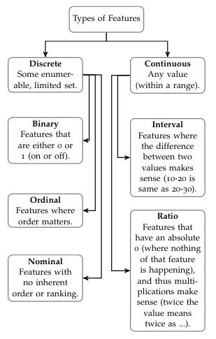
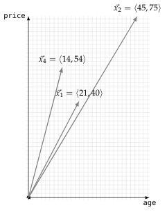
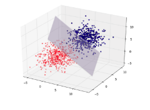

*This post focuses on exploratory dataset analysis — an important first step before engaging in any Data Science activities. We want to get to know our data: find interesting observations, anomalies in data, and think about how to go about solving the task. This used to be a Practical notebook for the Data Mining course I taught at Tilburg University. Most of the content assumes no prior knowledge of the field whatsoever (the associated lecture is embedded below), and is tailored at conducting critical analyses. Assignments are included.*

<iframe width="560" height="315" src="https://www.youtube.com/embed/-qOTEMVT9zM?si=uR_PlV8NOUSVxddW" title="YouTube video player" frameborder="0" allow="accelerometer; autoplay; clipboard-write; encrypted-media; gyroscope; picture-in-picture; web-share" referrerpolicy="strict-origin-when-cross-origin" allowfullscreen></iframe>

## 🔃 Refresher

Data Mining, Machine Learning, and all related fields have naming conventions related to data (types). This refresher will give you a short overview. Say we have a table (our data) describing ticket sales for concerts. See a small example below:

$$
\begin{array}{rrrrll}
\hline
\textbf{id} &    \textbf{gender} & \textbf{age} & \textbf{price} & \textbf{concert} & \textbf{genre} \\
\hline
01 & f & 21 & 40 & \text{AC/DC}         & \text{hard rock} \\
07 & m & 45 & 75 & \text{Ed Sheeran}      & \text{acoustic} \\
11 & m & 30 & 64 & \text{Depeche Mode} & \text{electronic} \\
05 & f & 14 & 54 & \text{Hans Zimmer}     & \text{instrumental} \\
\hline
\end{array}
$$

> *Ticket instances containing customer & meta-data regarding their sales.*

Each line (or row) of data is what we call an **instance** (can also be referred to as an entry, observation, or data point). An instance usually refers to something concrete: a person, an animal, a song, a document, or in this case: a ticket. Instances are described by **features** (also known as variables, or attributes), they tell you some (hopefully) characteristic information about these instances. Instances can be represented mathematically as a feature vector. For the first instance above, this would be noted as:

$$
\vec{x}_1 = \langle 01, \text{f}, 21, 40, \text{AC/DC}, \text{hard rock} \rangle
$$

Where $\vec{x}$ is the vector, and subscript 1 the index.

### 👀 Interpreting Features: Continuous vs Discrete

This doesn't simply work, however. In general, we want to be able to do calculations with these data. As such, features with what we call strings (letters) cannot be used in their raw form (e.g. `f, AC/DC`). For the sake of simplicity, we will get rid of the concert and genre features for this example. The gender variable can be re-coded to `0` for `f` and `1` for `m`. So, we will get:

$$
\vec{x}_1 = \langle 1, 0, 21, 40 \rangle
$$

Now, the remaining 4 features also require a bit of interpretation. We distinguish between **continuous** features and **discrete** features. Continuous features are real valued and can be within some range, whereas discrete features are finite, and are usually associated with some label or category. In our example, `id`, `age` and `price` are all considered numeric (technically, they are all **ratio**). Gender can either be **binary** feature (`0 = f` and `1 = m`), or other gender identities might be added, making it **nominal**. See the figure 👇 for further info.

<center>



</center>

### 🌌 Feature Spaces

Conveniently, using this numeric representation allows each instance to be represented as a point in a space (or $n$-dimensional graph). So say that we plot the age on the $x$ and price on the $y$-axis for some instances, our feature space as this is called, will look like the figure shown 👇. 

<center>



</center>

This is a 2-dimensional space (with 2 axes). A bit fancier 3-D space can be in the figure 👇. However, we have 4 features; so, this would have to be plotted in a 4-dimensional space. Unfortunately, we as humans can only see as much as 3-dimensions, so there's no way to show you how our actual feature space would look like (even colors and shapes will only get us so far). Luckily, computers can do the heavy lifting here.

<center>



</center>


## 🧠 Understanding Your Data


Your first step as a data scientist (as frequently repeated in the lecture) is to *know* your data. Everyone can learn to fire up a program and click a few buttons, or write a few lines of code. It is your task, however, to understand this data and generate creative insights and be able to communicate these (in the form of a research paper or presentation). It is therefore important to know the possibilities and limitations of your data. The first dataset we’ll be working with is the Titanic set.

ℹ️ [Task](https://www.kaggle.com/c/titanic/data) &nbsp;  &nbsp; 💽 [Data](https://www.kaggle.com/c/titanic/data) ([raw](https://raw.githubusercontent.com/tcsai/data-mining/master/data/Titanic/titanic.csv))  &nbsp;  &nbsp; 🐙 [Git](https://github.com/tcsai/data-mining/blob/master/data/Titanic/titanic.csv)

> *The course this notebook was designed for used Jupyter*. Instructions are generally tailored towards this. You can right-click the `(raw)` link of the data to save it, and upload it into Jupyter by clicking the `Upload` button in the right top corner. If you use JupyterLab it's the ⬆️ button on the left top somewhere. Please note that Windows does not have file extensions enabled by default, so it might look like it's not saved as `.csv`. You can enable this view like [so](https://knowledge.autodesk.com/search-result/caas/sfdcarticles/sfdcarticles/How-to-enable-hidden-file-extensions-in-Windows.html).

### 🔮 Starting out in Jupyter

Now that we have the data prepped, let's get started. We're first going to create a notebook cell with a few conveniences. The first line `%matplotlib inline` makes sure that whenever there's a plot, it is displayed in our browser (otherwise it would just output some text). The other lines import the `warning` package and disable some warnings from Python (pandas sometimes throws warnings for functions that will not work in some new version and such). These clutter our notebook, so we don't want them here (obviously, they are important to consider outside of the context of this task).

```python
%matplotlib inline

import warnings
warnings.simplefilter(action='ignore')
```

> [pandas.DataFrame - pandas documentation](https://pandas.pydata.org/docs/reference/api/pandas.DataFrame.html)

Now, we want to load `titanic.csv`. We shorthand pandas to `pd` and then load the `csv` file into our `DataFrame`([docs](https://pandas.pydata.org/docs/reference/api/pandas.DataFrame.html)) using `read_csv` ([docs](https://pandas.pydata.org/docs/reference/api/pandas.read_csv.html)). We will be providing links to the documentation of the objects and functions that we're using. Here you can see information regarding the **parameters** that a function takes. They are basically 'options' for a certain function. As you can see, `read_csv` has an `index_col`, but also for example `sep`, which—if you read the documentation—can be used to indicate the `.csv` file **delimiter**. Delimiter, here, means the character separating the values in our `.csv` file (by default it's set to `','` which corresponds to the format of our file). The index column is used to **uniquely** identify all your instances (usually with a number). The Titanic dataset has an actual index column, namely `PassengerId`. However, as it is unique for every instance, we don't want to use it as a feature anyway (think about why).

Finally we store our dataframe in what's called a **variable**; a container with a name that we store our data (or any other object) under. Here, I call it `df` for dataframe. If we put this variable name on the last line in Jupyter, it will output the contents of the variable (in this case, our data). As such:

```python
# working local: './titanic.csv'
df = pd.read_csv('/srv/data-mining/data/Titanic/titanic.csv',
                 index_col='PassengerId')
df
```

Let's get into some of the operations that we can run on our Dataframe ([docs](https://pandas.pydata.org/docs/reference/api/pandas.DataFrame.html)). If you search the DataFrame documentation for **Methods**, they are all listed. These are all click-able, where more of their functionality is explained. It also short-lists the parameters of the function, if they are in between brackets (`[like,so]`), they are optional. The first one we'll be using
is `count()` (that, as you can see in the [docs](https://pandas.pydata.org/docs/reference/api/pandas.DataFrame.count.html), only has optional parameters). Let's try:

```python
df.count()
```

### 🥦 Interpreting Raw Data

Given this new information, try solving the following tasks. If we take a quick peek at the [Wiki](https://en.wikipedia.org/wiki/RMS_Titanic), we get some rough numbers for comparison:

> ''Titanic had around 885 crew members on board for her maiden voyage. [95] Like other vessels of her time, she did not have a permanent crew, and the vast majority of crew members were casual workers who only came aboard the ship a few hours before she sailed from Southampton. [96] 
Titanic's passengers numbered approximately 1,317 people: 324 in First Class, 284 in Second Class, and 709 in Third Class. Of these, 869 (66%) were male and 447 (34%) female. There were 107 children aboard, the largest number of which were in Third Class. [105] The ship was considerably under capacity on her maiden voyage, as she could accommodate 2,453 passengers---833 First Class, 614 Second Class, and 1,006 Third Class.''

### 🚩 Task 1

- How much of the data are we missing?
- Do you see any features that you do not understand the values of?
- Which information could we potentially use to determine the crew of the Titanic in this dataset?

> 💡 Solutions for all tasks are listed at the end.

---

We can try practicing parameter-use a bit by trying the `axis` parameter to get column-wise counts rather than row-wise. As you can see from this line in the docs: `DataFrame.count(axis=0, level=None, numeric_only=False)` axis is set to `0` by default. So we input:

```python
df.count(axis=1)
```

You may solve the difference between row-wise and column-wise counts for yourself. Also note that when getting any sort of counts for rows, they are always listed together with their index `PassengerId`. We can see which passenger paid how much fare by selecting a specific column. This is done with:

```python
df['Fare']
```

If we'd like to add the names to the output, we can list them like so:

```python
df[['Name', 'Fare']]
```

> [pandas.Series - documentation](https://pandas.pydata.org/docs/reference/api/pandas.Series.html)

Let's try aggregating some data. We're interested in how many passengers were in which economic class. Note that when sub-setting our `pd.DataFrame` object to only a single column, it actually turns into a `Series` ([docs](https://pandas.pydata.org/docs/reference/api/pandas.Series.html)). These have different methods (functions) than Dataframes. Try `value_counts` ([docs](https://pandas.pydata.org/docs/reference/api/pandas.Series.value_counts.html)).

```python
df['Pclass'].value_counts()
```

We can also aggregate even more 'complex' levels. Let's try grouping by Sex using `groupby()` ([docs](https://pandas.pydata.org/docs/reference/api/pandas.DataFrame.groupby.html)), which we simply add in between our previous line:

```python
df.groupby('Sex')['Pclass'].value_counts()
```

Just to quickly walk you through the steps: `groupby` splits the entire dataframe between sexes (so all feature values get divided between male and female). Convince yourself of this by running:

```python
df.groupby('Sex').count()
```

Notice that `count` is used here again, because `groupby`returns all columns in the Dataframe, so the object is still a Dataframe (not a Series). This in contrast to the line before, where we add `['Pclass']` to only select the class feature (turning it into a Series, because only one column).
For that one, we'd apply the `value_counts()`, as you can see. So, important take-away: always think if you're working on more than one column (dataframe), or just one (series), and see which methods you can use accordingly. Now we can safely go into exploring more methods.

### 📊 Visualization

Pandas works well for selecting (sub-setting) and plotting different entries within a dataset. We'll first look at a way to visualize certain feature distributions using **density plots** (see figure 👉), and see if we can group them by `Survived`. For all the features that we inspect, you will see if this influenced whether people survived the Titanic yes or no. Say that we'd want to check this for `Fare`, the first step would be:

<center>


</center>

> Density plot example from [Claus Wilke](https://clauswilke.com/dataviz/histograms-density-plots.html) (great source).

```python
df.groupby('Survived')['Fare']
```

Both DataFrames and Series have a `plot()` ([docs](https://pandas.pydata.org/docs/reference/api/pandas.DataFrame.plot.html)) method, with many possible parameters. You're free to check them out, for this we'll be using KDE (Kernel Density Estimation, or density plot). We make our line look like this:

```python
df.groupby('Survived')['Fare'].plot(kind='kde', legend=True)
```

The default plots in Pandas don't look too fancy (granted, it's not a plotting library, this is just convenient functionality). We can alter this somewhat by, for example:

```python
import matplotlib.pyplot as plt
plt.style.use('ggplot')
```

Try running the plot again! Now, if you start changing around the features, you'll notice that some aren't compatible with density plots (they throw an error). This is because they are discrete, and therefore don't have a density estimation. You can use bar plots for these:

```python
df.groupby('Survived')['Sex'].value_counts().plot(kind='bar')
```

You should be able to figure out why we didn't include `legend` here (hint: many groups). If you tried age, you see the warning `array must not contain infs or NaNs`. If you look at the very first `pd` table dump, you'll notice there are **NaN** ages (Not a Number). These are missing values. We can fix this with overwriting the age feature:

```python
df['Age'] = df['Age'].fillna(0)
```

Here, we fill the NaNs with 0. Now, when interpreting the results, take into account that zeroes are actually NaNs. You can up the complexity of the `groupby` function by stacking more features as a list, like so:

```python
df.groupby(['Sex', 'Pclass'])['Survived'].value_counts().plot(kind='bar')
```

You can also show the counts above in a table when removing `.plot(kind='bar')`, if you replace `value_counts()` with `mean(` you get the averages for each group split, etc. Using these plots and checking the table outputs you can answer the following questions:

### 🚩 Task 2

- Find two features where a certain group has a noticeable high mortality rate.
- Explain why this is the case with your knowledge of the dataset (having seen the movie might help, see 👇).

<center>


</center>

---

Distributions are pretty straight-forward to interpret; the visualization between two features is simple and effective. However, it also limits displaying interaction between several features (e.g. if young males tended have lower survival rates than females). For this, we can use **scatter plots** (see 👇).

<center>

](https://wac-cdn.atlassian.com/dam/jcr:f8fa3f04-1ccf-4140-8a5a-0cb4b15ac92f/scatter-plot-options-1.png?cdnVersion=1554g)

</center>

In pandas, you need to set an $x$ and $y$ label, like so:

```python
df.plot(x='somefeature', y='someotherfeature', kind='scatter')
```

To stack multiple subsets in one plot, and give them different colors, we have
to select them from the DataFrame based on some condition. We can do this for
example for `Survived` with the following piece of code:

```python
died_subset = df[df['Survived'] == 0]
live_subset = df[df['Survived'] != 0]
```

To break this down, the inner part (`df['Survived'] == 0`) returns the index numbers (that's where they come in handy!) where the value of `Survived` was equal to (`==`) zero (so the people who did not survive). The outer part `df[....]` then receives those index numbers, and returns a DataFrame with only the instances that met this condition of `'Survived == 0'`. If we want to do the inverse, we simply use `!=` (not equals), or, alternatively, `== 1`. We can plot these different subsets by generating to plots, storing the first in a variable, and passing that along to the second plot. Like so:

```python
```python
ax1 = died_subset.plot(
    x="somefeature",
    y="someotherfeature",
    label="Died",
    color="red",
    kind="scatter",
)
ax2 = live_subset.plot(
    x="somefeature",
    y="someotherfeature",
    label="Survived",
    color="green",
    kind="scatter",
    ax=ax1,
)

ax2  # to output
```

Now notice that we're adding two new parameters here, one to label a specific subset in the legend, and the other to color the instances of the specific subset differently. We can also add an `alpha` parameter to determine transparency of the dots (e.g., by setting that to `0.5`).

### 🚩 Task 3

- Set `Sex` to $x$, and `Pclass` to $y$. What can you conclude?
- Set `Age` to $x$, and `Fare` to $y$. Do these features correlate?
- Split the above plot by `Survived`, do you see a pattern in the data?

### 🧪 Testing Hypotheses

If you followed through all above tasks, you now hopefully developed some intuition regarding which features might have a relation. The Titanic was a pretty interesting reflection of society  round the 1900's. It opens up some potential for statistical analyses and some richer measurements. We'll look at boxplots for this section, and some very basic pointers on how to run stats in Python.

Pandas provides the usual boxplot annotations for the mean, median, standard deviation, min, max, (if you need a refresher on these, read: [link](https://www.ltcconline.net/greenl/courses/201/descstat/mean.htm), see figure 👇) and SciPy provides a statistical test for a set variable, between the classes of the provided subgroup.


Through this, you can test if for example `Fare` had an effect on your  survivability. [Boxplots](https://pandas.pydata.org/docs/reference/api/pandas.DataFrame.boxplot.html) have a `column` parameter to select features (should be in a list format), and `by` to group. So you can do something like:

```python
df.boxplot(column=['Fare'], by='Survived')
```

Then finally, `scipy.stats` also has an implementation for `ttests` and the like. Given that we have a lot of unbalanced groups and some binary data, we're not going to go in the statistical mess required to say anything sensible about these here. Just know that the tests are available. To round off the practical:

### 🚩 Task 4

---

- Determine a likely ticket price to survive the Titanic.

> 🏁 You've reached the end of the first practical! Solutions are below.

## ✅ Solutions

### 🏁 Task 1

- Given the Titanic Wiki quote, we see that there were 1317 passengers. So we're missing 1317 - 891 passengers (see `df.count()`).
- This is personal: if you aren't sure, look at the docs what they mean, and **especially** what the values are!
- Well, if you read the quote carefully we know that it's highly unlikely that there's any crew in the dataset. Some features could however be: Fare (if that would be 0), or Embarked (see Wiki).

### 🏁 Task 2

- `Pclass` and `Sex`.
- Women and children first, ice hit the boat in the lower deck (lower class). Most of the latter drowned before even making it to any lifeboats.

### 🏁 Task 3

- Not more than that they are two discrete features and scatter plots only work for continuous ones.
- Not strong enough to clearly see a visual correlation. You can test it using `scipy.stats.pearsonr` ([docs](https://docs.scipy.org/doc/scipy/reference/generated/scipy.stats.pearsonr.html)). Like such:

```python
df['Sex'] = pd.get_dummies(df['Sex'])  # convert numerical to discrete

# make sure to reconstruct the subsets based on the Dataframe with the 
# now fixed variable encoding
died_subset = df[df['Survived'] == 0]
live_subset = df[df['Survived'] != 0]

# plot here
```

```python
from scipy.stats import pearsonr

pearsonr(df['Age'], df['Fare'])  # run df['Age'].fillna(0) before!
```

- There are a few observations we can make, but not necessarily very clear patterns. It looks like from low-fare payers over 40, the majority seems to be a non-survivor. We can also see that the high fare payers generally survived (there are even a few super high outliers with 500+
fare, they survived).

### 🏁 Task 4

- With paid Fair upwards from 50, you're an outlier if you die.